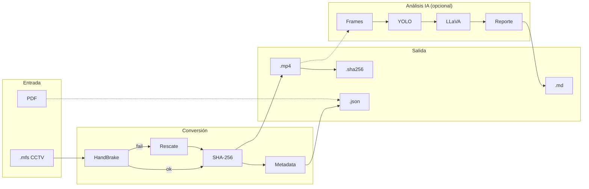
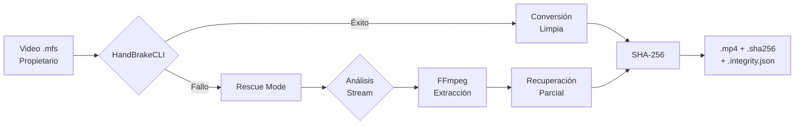
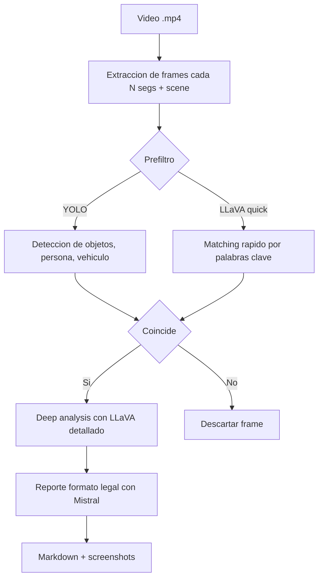

# Vigilant — Forensic Video Processing Suite


**Vigilant** es una suite de procesamiento forense de video que convierte formatos propietarios de CCTV a estándares abiertos, con análisis visual asistido por IA local y chain of custody automatizado para conversiones. Diseñado para investigadores, analistas forenses y profesionales de seguridad que requieren trazabilidad y verificación independiente.

## Arquitectura del Sistema



## Características Principales

### 1. Conversión Forense

**Problema resuelto:** Los sistemas de CCTV propietarios generan archivos en formatos cerrados (por ejemplo `.mfs`) que no se pueden reproducir en reproductores estándar. Esto dificulta:
- Revisión de evidencia en equipos forenses
- Preservación a largo plazo
- Presentación en procesos legales
- Compartir con peritos externos

**Solución de Vigilant:**



**Características de conversión:**

- **Multi-herramienta:** HandBrakeCLI como primario, FFmpeg como fallback
- **Pipeline de rescate:** Recuperación automática de archivos corruptos o parcialmente dañados
- **Integridad forense:** SHA-256 de origen y destino calculados automáticamente
- **Metadata completa:** Herramienta, preset, comando, versión, timestamps y tamaños
- **Reproducibilidad:** Metadata de contenedor normalizada y comandos registrados para reducir variación entre ejecuciones
- **Batch processing:** Conversión masiva de directorios completos

**Archivos generados por conversión:**

```bash
input/
  └── footage_2024_01_15.mfs

output/
  ├── footage_2024_01_15.mp4              # Video convertido
  ├── footage_2024_01_15.mp4.sha256       # Hash verificable
  └── footage_2024_01_15.mp4.integrity.json  # Metadata forense
```

**Ejemplo de metadata forense (`*.integrity.json`):**

```json
{
  "integrity_version": "1.0",
  "timestamp": "2026-01-31T14:23:45.123456+00:00",
  "source": {
    "path": "/input/footage_2024_01_15.mfs",
    "filename": "footage_2024_01_15.mfs",
    "sha256": "a3f5e9c2d1b8f4e6a9c0d5e8f1a4b7c2...",
    "size_bytes": 1258291200
  },
  "converted": {
    "path": "/output/footage_2024_01_15.mp4",
    "filename": "footage_2024_01_15.mp4",
    "sha256": "d9e3f6a0b5c8d2e7f1a6b9c4d8e3f7a2...",
    "size_bytes": 987654321
  },
  "conversion": {
    "tool": "HandBrake+ffmpeg normalize",
    "preset": "Fast 1080p30",
    "command": "HandBrakeCLI -i /input/footage_2024_01_15.mfs -o /output/footage_2024_01_15.mp4 --preset 'Fast 1080p30' && ffmpeg -y -i /output/footage_2024_01_15.mp4 -map_metadata -1 -map_chapters -1 -fflags +bitexact -flags:v +bitexact -flags:a +bitexact -c copy /output/footage_2024_01_15_normalized.mp4",
    "tool_version": "HandBrakeCLI 1.6.1; ffmpeg 6.1",
    "rescue_mode": false
  }
}
```

### 2. Análisis Visual con IA (Característica Complementaria)

**Problema resuelto:** Revisar manualmente horas de video CCTV es impracticable. Se necesita asistencia para identificar rápidamente frames relevantes.

**Solución de Vigilant:**



**Características:**
- **Filtrado YOLO**: Pre-clasifica frames por categoría (persona, vehículo, etc.)
- **Verificación profunda**: LLaVA evalúa contexto completo del frame
- **Embeddings semánticos (opcional)**: Filtrado de resultados por similitud conceptual para reducir falsos positivos (si `ai.use_embeddings=true`)
- **Detección de movimiento (solo YOLO, opcional)**: Confirma objetos en movimiento según bounding boxes (si `ai.filter_backend=yolo` y `motion.enable=true`)

**Nota importante:** El análisis IA es una **herramienta de asistencia investigativa**. Los resultados deben ser revisados por profesionales calificados. No reemplaza el juicio humano.

### 3. Chain of Custody

- Hashes SHA-256 de origen y conversión
- Archivos `.sha256` en formato estándar (compatible con `sha256sum`, con comentario/label opcional)
- Metadata forense completa (`.integrity.json`)
- Comando y versión de herramienta registrados en metadata
- Timestamps UTC y registro de transformaciones
- Verificación de integridad post-transferencia

### 4. Procesamiento PDF

- Extracción de metadata de reportes PDF
- Conversión a JSON estructurado
- Preparación de metadata para correlación manual con evidencia de video

## Alcance Técnico

- **Inputs**: `.mfs` (CCTV), `.pdf` (reportes)
- **Outputs**: `.mp4`, `.json` (metadata), reportes markdown + screenshots
- **Integridad**: SHA-256, metadata de conversión, timestamps UTC
- **IA**: LLaVA para análisis, Mistral para reportes, YOLO opcional para prefiltro
- **Modos**: Offline, reproducible, sin dependencias cloud

## Requisitos del Sistema

### Software Básico
- Python 3.8 o superior
- `ffmpeg` (procesamiento de video)
- `HandBrakeCLI` (conversión primaria)
- [Ollama](https://ollama.com/) (motor de IA local, requerido solo para `vigilant analyze`)

### Dependencias Opcionales
- `ultralytics` + modelo YOLO (prefiltro rápido)
- Docker + Docker Compose (deployment containerizado)

### Modelos de IA Recomendados
```bash
ollama pull llava:13b        # Análisis visual
ollama pull mistral:latest   # Generación de reportes
ollama pull nomic-embed-text # Embeddings semánticos (opcional)
```

## Instalación Rápida

### Instalación Local

```bash
# Clonar el repositorio
git clone https://github.com/matzalazar/vigilant.git
cd vigilant

# Instalar dependencias core
pip install -r requirements.txt
pip install -e .

# Verificar instalación
vigilant --version

# Verificar dependencias externas
vigilant --check
```

### Setup Automatizado

```bash
# Instalación completa con entorno virtual y YOLO
./scripts/setup.sh --with-yolo --download-yolo

# Solo CPU (sin GPU)
./scripts/setup.sh --with-yolo --cpu-only
```

### Docker (Recomendado para Producción)

```bash
# Iniciar servicios (Vigilant + Ollama)
docker compose up -d

# Verificar estado
docker compose ps

# (Opcional) Convertir evidencia .mfs -> .mp4 (si hay archivos en data/mfs/)
docker exec vigilant-app vigilant convert

# Ejecutar análisis
docker exec vigilant-app vigilant analyze --prompt "persona con chaleco"
```

> En modo Docker, las variables de entorno (rutas, `VIGILANT_OLLAMA_URL`, etc.) se configuran en `docker-compose.yml` (o overrides). El archivo `.env` se usa principalmente para ejecución local (python-dotenv).

Documentación completa: [`docs/12_docker_quickstart.md`](docs/12_docker_quickstart.md)

## Configuración

### Variables de Entorno (`.env`)

```ini
# Rutas de entrada/salida (requerido)
VIGILANT_INPUT_DIR="/mnt/evidence/raw"
VIGILANT_OUTPUT_DIR="/mnt/evidence/processed"

# Modelo YOLO (opcional)
VIGILANT_YOLO_MODEL="/path/to/yolov8n.pt"

# Nivel de logging (opcional, default: INFO)
VIGILANT_LOG_LEVEL="DEBUG"
```

### Archivos YAML

- `config/default.yaml`: Configuración por defecto (versionada)
- `config/local.yaml`: Overrides locales (ignorada por git)

**Precedencia**: `default.yaml` → `local.yaml` → variables de entorno

Documentación completa: [`docs/06_guia_de_configuracion.md`](docs/06_guia_de_configuracion.md)

## Uso

### Conversión de Videos

```bash
# Convertir todos los archivos .mfs en el directorio de entrada
# (Rescate automático: activo por defecto)
vigilant convert

# (Opcional) Desactivar rescate automático
vigilant convert --no-rescue

# Salida: archivos .mp4 + .sha256 + .integrity.json
```

### Parseo de Reportes PDF

```bash
# Extraer metadata de reportes PDF a JSON
vigilant parse

# Salida: archivos .json con metadata estructurada
```

### Análisis Visual con IA

```bash
# Búsqueda de objeto/persona específica
vigilant analyze --prompt "Vehículo oscuro en movimiento"

# Análisis de archivo específico
vigilant analyze --video evidence.mp4 --prompt "Persona con mochila roja"

# Salida:
# - Reporte: data/reports/md/analysis_<slug>_<timestamp>.md
# - Screenshots: data/reports/imgs/
# Nota: el "Informe juridico (IA)" se sanitiza; si se descarta, el reporte lo indicará.
```

> `data/` y `logs/` se consideran directorios de runtime (inputs/outputs) y no se versionan en git.
> Para ver una corrida real con artefactos anonimizados incluidos en el repo, ver `examples/`.

## Arquitectura

```
vigilant/
├── core/           # Configuración, logging, integridad forense
├── converters/     # HandBrake, FFmpeg, pipeline de rescate
├── parsers/        # Extracción de metadata PDF
└── intelligence/   # Análisis de IA (extracción de frames, LLaVA, YOLO)
```

**Flujo de procesamiento**:
1. Conversión (`.mfs` → `.mp4` con chain of custody)
2. Extracción de frames (interval/scene/híbrido)
3. Prefiltro opcional (YOLO o LLaVA rápido)
4. Análisis profundo (LLaVA detallado)
5. Generación de reporte (Mistral en formato legal)

Documentación completa: [`docs/03_arquitectura_tecnica.md`](docs/03_arquitectura_tecnica.md)

## Testing

```bash
# Instalar dependencias de desarrollo
pip install -e ".[dev]"

# Ejecutar suite completa
pytest -v

# Con cobertura
pytest -v --cov=vigilant --cov-report=term-missing

# Solo tests rápidos
pytest -v -m "not slow"
```

Documentación: [`docs/11_tests.md`](docs/11_tests.md)

## Documentación

### Documentación Técnica (`docs/`)
- [`00_indice.md`](docs/00_indice.md) - Índice de documentación
- [`01_instalacion_y_configuracion.md`](docs/01_instalacion_y_configuracion.md) - Setup detallado
- [`02_chain_of_custody.md`](docs/02_chain_of_custody.md) - Integridad forense y chain of custody
- [`03_arquitectura_tecnica.md`](docs/03_arquitectura_tecnica.md) - Diseño del sistema
- [`06_guia_de_configuracion.md`](docs/06_guia_de_configuracion.md) - Referencia de configuración
- [`10_troubleshooting.md`](docs/10_troubleshooting.md) - Resolución de problemas comunes
- [`11_tests.md`](docs/11_tests.md) - Ejecución de tests
- [`12_docker_quickstart.md`](docs/12_docker_quickstart.md) - Deployment con Docker

## Casos de Uso

**Investigaciones Forenses**
- Conversión de evidencia CCTV propietaria a formatos estándar
- Búsqueda rápida de personas/vehículos en horas de grabación
- Generación de reportes en formato legal (IA) con hash SHA-256 y trazabilidad

**Análisis de Seguridad**
- Revisión retrospectiva de incidentes
- Identificación de patrones sospechosos
- Correlación manual de eventos con reportes PDF

**Archivo y Preservación:** Vigilant convierte formatos propietarios (actualmente `.mfs`) a MP4 estándar H.264, manteniendo:
- **Cadena de custodia**: SHA-256 hashes de fuente y destino
- **Metadata forense**: JSON con comando exacto ejecutado, versiones de herramientas, timestamps
- **Verificación independiente**: Cualquier investigador puede verificar hashes y metadata con herramientas estándar

## Consideraciones

Este proyecto **NO** incluye:
- Interfaz gráfica (GUI)
- Streaming en tiempo real
- Procesamiento en la nube
- Integraciones con sistemas propietarios fuera del nivel de archivos
- Toma de decisiones automatizada (es una herramienta de asistencia)

## Contribuir

Las contribuciones son bienvenidas. Por favor lee `CONTRIBUTING.md` para detalles sobre nuestro código de conducta y proceso de pull requests.

## Licencia

Este proyecto está licenciado bajo GPL-3.0. Ver archivo `LICENSE` para detalles.

**Nota sobre uso forense**: Este software es una herramienta de asistencia investigativa. Los resultados deben ser revisados por profesionales calificados. No reemplaza el juicio humano ni la cadena de custodia física.

## Autor

**Matías L. Zalazar**

## Servicios Profesionales y Soporte

Si tu institución requiere implementar **Vigilant** en un entorno de producción, ofrezco servicios especializados de:

* **Setup e Implementación:** Configuración de estaciones de trabajo forenses *air-gapped* y optimización de hardware para IA local.
* **Capacitación Técnica:** Formación sobre cadena de custodia digital, gestión de integridad con SHA-256 y uso de modelos de visión para análisis de evidencia.
* **Consultoría de Procesos:** Adaptación de la suite a flujos de trabajo investigativos específicos.

Podés contactarme a través de [LinkedIn](https://www.linkedin.com/in/matzalazar/) o a través de mi sitio web [matzalazar.com](https://matzalazar.com).

### Apoyo al proyecto

**Vigilant** es software libre y de código abierto. Si la herramienta te fue de utilidad en una investigación o quieres apoyar el desarrollo de nuevas funciones, podés invitarme un Cafecito:

[](https://cafecito.app/matzalazar)

## Recursos Adicionales

- Documentación completa: [`docs/00_indice.md`](docs/00_indice.md)
- Issues y soporte: [GitHub Issues](https://github.com/matzalazar/vigilant/issues)
- Ejemplos: `examples/`
