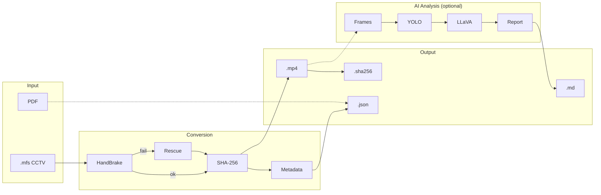
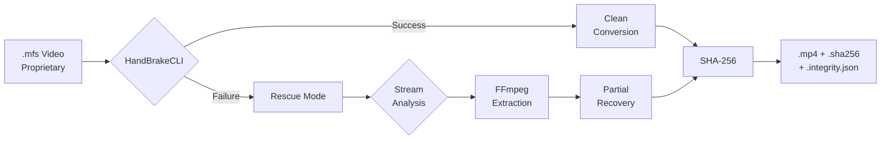
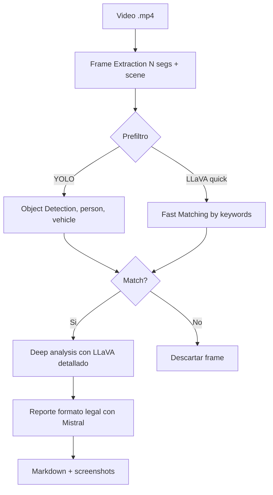

# Vigilant — Forensic Video Processing Suite


**Vigilant** is a professional forensic video processing suite that converts proprietary CCTV formats to open standards, with local AI-assisted visual analysis and automated chain of custody for conversions. Designed for investigators, forensic analysts, and security professionals requiring traceability and independent verification.

## System Architecture



## Key Features

### 1. Forensic Conversion (Core Project)

**Problem solved:** Proprietary CCTV systems generate files in closed formats (currently `.mfs`) that cannot be played in standard players. This makes it difficult to:
- Review evidence on forensic equipment
- Long-term preservation
- Presentation in legal proceedings
- Share with external experts

**Vigilant's solution:**



**Conversion features:**

- **Multi-tool:** HandBrakeCLI as primary, FFmpeg as fallback
- **Rescue pipeline:** Automatic recovery of corrupted or partially damaged files
- **Forensic integrity:** SHA-256 of source and destination calculated automatically
- **Complete metadata:** Tool, preset, command, version, timestamps, and sizes recorded
- **Reproducibility:** Container metadata normalized and commands recorded to reduce variation across runs
- **Batch processing:** Mass conversion of complete directories

### 2. AI-Powered Visual Analysis (Complementary Feature)

**Problem solved:** Manually reviewing hours of CCTV video is impractical. Assistance is needed to quickly identify relevant frames.

**Vigilant's solution:**



**Analysis features:**

- **Local and offline:** Ollama runs models on your machine, no cloud data transfer
- **Two prefilter modes:** YOLO (fast, common objects) or LLaVA (flexible, any criteria)
- **Motion detection (YOLO-only, optional):** Additional context for dynamic objects (when `ai.filter_backend=yolo` and motion is enabled)
- **Deep analysis:** Detailed forensic descriptions of relevant frames
- **Legal-format reports (AI-assisted):** Professional format generated by Mistral
- **Semantic embeddings (optional):** Similarity-based filtering to reduce false positives (when `ai.use_embeddings=true`)

**Important note:** AI analysis is an **investigative assistance tool**. Results must be reviewed by qualified professionals. It does not replace human judgment.

### 3. Chain of Custody

- SHA-256 hashes of source and conversion
- `.sha256` files in standard format (compatible with `sha256sum`, optional comment/label line)
- Complete forensic metadata (`.integrity.json`)
- Command and tool version recorded in metadata
- UTC timestamps and transformation logging
- Post-transfer integrity verification

### 4. PDF Processing

- Metadata extraction from PDF reports
- Structured JSON conversion
- Preparation for manual correlation with video evidence

## Technical Scope

- **Inputs**: `.mfs` (CCTV), `.pdf` (reports)
- **Outputs**: `.mp4`, `.json` (metadata), markdown reports + screenshots
- **Integrity**: SHA-256, conversion metadata, UTC timestamps
- **AI**: LLaVA for analysis, Mistral for reports, optional YOLO prefilter
- **Modes**: Offline, reproducible, no cloud dependencies

## System Requirements

### Core Software
- Python 3.8 or higher
- `ffmpeg` (video processing)
- `HandBrakeCLI` (primary conversion)
- [Ollama](https://ollama.com/) (local AI engine, required only for `vigilant analyze`)

### Optional Dependencies
- `ultralytics` + YOLO model (fast prefilter)
- Docker + Docker Compose (containerized deployment)

### Recommended AI Models
```bash
ollama pull llava:13b        # Visual analysis
ollama pull mistral:latest   # Report generation
ollama pull nomic-embed-text # Semantic embeddings (optional)
```

## Quick Installation

### Local Installation

```bash
# Clone the repository
git clone https://github.com/matzalazar/vigilant.git
cd vigilant

# Install core dependencies
pip install -r requirements.txt
pip install -e .

# Verify installation
vigilant --version

# Verify external dependencies
vigilant --check
```

### Automated Setup

```bash
# Full installation with virtual environment and YOLO
./scripts/setup.sh --with-yolo --download-yolo

# CPU-only (no GPU)
./scripts/setup.sh --with-yolo --cpu-only
```

### Docker (Recommended for Production)

```bash
# Start services (Vigilant + Ollama)
docker compose up -d

# Check status
docker compose ps

# (Optional) Convert evidence .mfs -> .mp4 (if there are files in data/mfs/)
docker exec vigilant-app vigilant convert

# Run analysis
docker exec vigilant-app vigilant analyze --prompt "person with vest"
```

> In Docker mode, environment variables (paths, `VIGILANT_OLLAMA_URL`, etc.) are configured in `docker-compose.yml` (or overrides). The `.env` file is mainly for local execution (python-dotenv).

Complete documentation: [`docs/12_docker_quickstart.md`](docs/12_docker_quickstart.md)

## Configuration

### Environment Variables (`.env`)

```ini
# Input/output paths (required)
VIGILANT_INPUT_DIR="/mnt/evidence/raw"
VIGILANT_OUTPUT_DIR="/mnt/evidence/processed"

# YOLO model (optional)
VIGILANT_YOLO_MODEL="/path/to/yolov8n.pt"

# Logging level (optional, default: INFO)
VIGILANT_LOG_LEVEL="DEBUG"
```

### YAML Files

- `config/default.yaml`: Default configuration (versioned)
- `config/local.yaml`: Local overrides (ignored by git)

**Precedence**: `default.yaml` → `local.yaml` → environment variables

Complete documentation: [`docs/06_guia_de_configuracion.md`](docs/06_guia_de_configuracion.md)

## Usage

### Video Conversion

```bash
# Convert all .mfs files in input directory
# (Automatic rescue: enabled by default)
vigilant convert

# (Optional) Disable automatic rescue
vigilant convert --no-rescue

# Output: .mp4 files + .sha256 + .integrity.json
```

### PDF Report Parsing

```bash
# Extract metadata from PDF reports to JSON
vigilant parse

# Output: .json files with structured metadata
```

### AI Visual Analysis

```bash
# Search for specific object/person
vigilant analyze --prompt "Dark vehicle in motion"

# Analyze specific file
vigilant analyze --video evidence.mp4 --prompt "Person with red backpack"

# Output:
# - Report: data/reports/md/analysis_<slug>_<timestamp>.md
# - Screenshots: data/reports/imgs/
# Note: the "Legal report (AI)" section is sanitized; if it is discarded, the report will say so.
```

> `data/` and `logs/` are treated as runtime directories (inputs/outputs) and are not committed to git.
> For a real run with anonymized artifacts included in the repository, see `examples/`.

## Architecture

```
vigilant/
├── core/           # Configuration, logging, forensic integrity
├── converters/     # HandBrake, FFmpeg, rescue pipeline
├── parsers/        # PDF metadata extraction
└── intelligence/   # AI analysis (frame extraction, LLaVA, YOLO)
```

**Processing flow**:
1. Conversion (`.mfs` → `.mp4` with chain of custody)
2. Frame extraction (interval/scene/hybrid)
3. Optional prefilter (YOLO or fast LLaVA)
4. Deep analysis (detailed LLaVA)
5. Report generation (Mistral in legal format)

Complete documentation: [`docs/03_arquitectura_tecnica.md`](docs/03_arquitectura_tecnica.md)

## Testing

```bash
# Install development dependencies
pip install -e ".[dev]"

# Run full test suite
pytest -v

# With coverage
pytest -v --cov=vigilant --cov-report=term-missing

# Fast tests only
pytest -v -m "not slow"
```

Documentation: [`docs/11_tests.md`](docs/11_tests.md)

## Documentation

### Technical Documentation (`docs/`)
- [`00_indice.md`](docs/00_indice.md) - Documentation index
- [`01_instalacion_y_configuracion.md`](docs/01_instalacion_y_configuracion.md) - Detailed setup
- [`02_chain_of_custody.md`](docs/02_chain_of_custody.md) - Forensic integrity and chain of custody
- [`03_arquitectura_tecnica.md`](docs/03_arquitectura_tecnica.md) - System design
- [`06_guia_de_configuracion.md`](docs/06_guia_de_configuracion.md) - Configuration reference
- [`10_troubleshooting.md`](docs/10_troubleshooting.md) - Troubleshooting
- [`11_tests.md`](docs/11_tests.md) - Running tests
- [`12_docker_quickstart.md`](docs/12_docker_quickstart.md) - Docker deployment

## Use Cases

**Forensic Investigations**
- Convert proprietary CCTV evidence to standard formats
- Quick search for people/vehicles in hours of footage
- Generate legal-format reports (AI-assisted) with SHA-256 and traceability

**Security Analysis**
- Retrospective incident review
- Suspicious pattern identification
- Manual event correlation with PDF reports

**Archival and Preservation**
- Migrate proprietary formats to open standards
- Long-term integrity verification
- Forensic metadata for traceability

## Non-Goals

This project does **NOT** include:
- Graphical user interface (GUI)
- Real-time streaming
- Cloud processing
- Integrations with proprietary systems beyond file level
- Automated decision-making (this is an investigative assistance tool)

## Contributing

Contributions are welcome. Please read `CONTRIBUTING.md` for details about our code of conduct and pull request process.

## License

This project is licensed under GPL-3.0. See `LICENSE` file for details.

**Note on forensic use**: This software is an investigative assistance tool. Results must be reviewed by qualified professionals. It does not replace human judgment or physical chain of custody.

## Author

**Matías L. Zalazar**

## Additional Resources

- Complete documentation: [`docs/00_indice.md`](docs/00_indice.md)
- Issues and support: GitHub Issues
- Examples: `examples/` interoperability