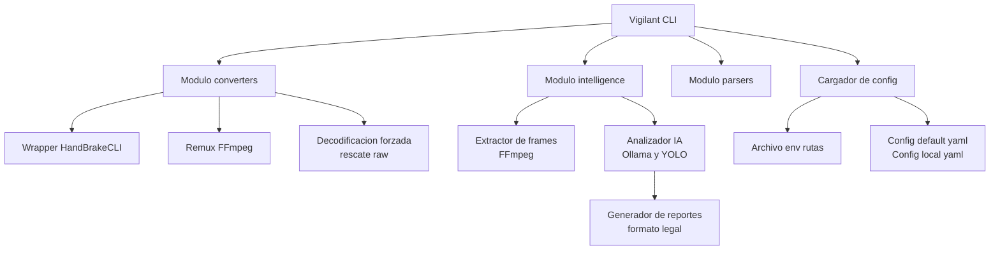

# Arquitectura Técnica

Este documento describe la arquitectura de runtime, límites de módulos y flujo de
datos a través del pipeline de Vigilant.

## 1. Flujo de Datos de Alto Nivel

## 2. Límites de Módulos

### 2.1 Core
`vigilant/core`

- `config.py`: Cargador YAML + env, perfiles de escenario, defaults
- `logger.py`: Logging a consola + archivo, control de nivel

### 2.2 Converters
`vigilant/converters`

- `handbrake.py`: Transcode primario a MP4
- `ffmpeg.py`: Fallback de remux (copy)
- `rescue.py`: Hints de codec, escaneo de offset, decodificación forzada, fallback rawvideo

### 2.3 Parsers
`vigilant/parsers`

- `pdf_parser.py`: Extrae metadata a JSON

### 2.4 Intelligence
`vigilant/intelligence`

- `frame_extractor.py`: Generación de frames basada en muestras/escena (FFmpeg)
- `analyzer.py`: Prefiltro LLaVA + análisis profundo + generación de reporte
- Prefiltro YOLO y lógica de movimiento integrados a nivel CLI

## 3. Puntos de Entrada CLI

`vigilant/cli.py` expone:

- `convert`: Batch MFS a MP4 con rescate
- `parse`: Extracción de metadata PDF
- `analyze`: Análisis de IA multi-etapa

Estos comandos son intencionalmente ortogonales y pueden componerse en pipelines
de automatización externos.

## 4. Resolución de Config y Perfiles

La configuración se carga desde:

1) `config/default.yaml`
2) `config/local.yaml`
3) Variables de entorno

Después de fusionar archivos YAML, los perfiles de escenario pueden aplicar overrides
basados en campos `scenario` (cámara, iluminación, movimiento). Las variables de
entorno siempre ganan.

## 5. Artefactos de Salida

El pipeline emite artefactos reproducibles:

- Salida MP4 reflejada de la estructura de directorios de entrada
- Metadata JSON del parsing de PDF
- Reportes de análisis en `data/reports/md/`
- Screenshots de hits en `data/reports/imgs/`

Datos temporales de trabajo:
- `data/tmp/<video>/` para extracción de frames

## 6. Observabilidad

El logging está estructurado:

- Consola: conciso, legible para humanos
- Archivo: verbose para inspección postmortem

Esto habilita trazabilidad forense para:
- conversiones
- intentos de rescate
- prompts de análisis
- conteos de coincidencias y timings
