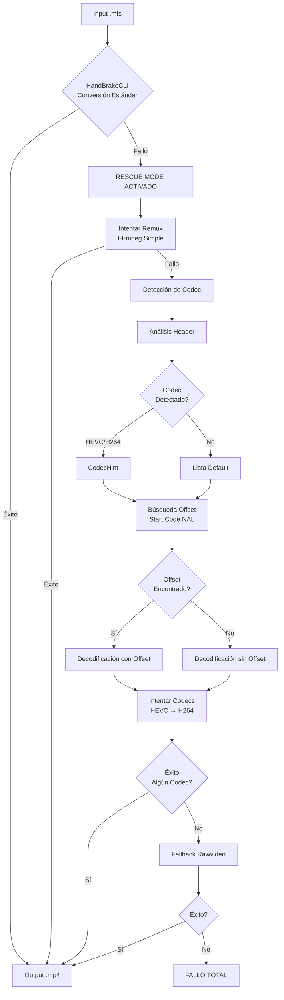

# Pipeline de Rescate - Documentación Técnica

Este documento describe el funcionamiento interno del pipeline de rescate de Vigilant para recuperación de archivos de video corruptos o no estándar.

> [!IMPORTANT]
> Vigilant **solo se ejecuta vía CLI**. Este documento muestra implementación interna para referencia técnica.

## Contexto

Los archivos de CCTV propietarios (actualmente `.mfs`) frecuentemente presentan problemas:

- **Codec no Estándar:** Uso de codecs propietarios o modificaciones de codecs estándar
- **Corrupción Parcial:** Grabaciones interrumpidas por falta de energía o fallas de sistema
- **Headers Inválidos:** Metadata corrupta que impide decodificación con herramientas estándar
- **Streams Incompletos:** Falta de información de índice o fragmentación
- **Multiplexado No Estándar:** Contenedores que no siguen especificaciones completas

**HandBrakeCLI** es la herramienta primaria para conversión, pero falla ante estos problemas. El **pipeline de rescate** implementa estrategias progresivas de recuperación.

## Arquitectura del Pipeline



## Fases del Rescue Mode

El pipeline de rescate implementa las siguientes estrategias en orden:

### 1. Remux Simple (Fase Previa)

**Objetivo:** Intentar conversión simple preservando estructura original.

Antes de activar el rescue mode completo, se intenta un remux básico:

```python
def fallback_conversion_ffmpeg(input_path: Path, output_path: Path) -> bool:
    """Intenta conversión simple con FFmpeg."""
    cmd = [
        "ffmpeg", "-y", "-i", str(input_path),
        "-map_metadata", "-1",
        "-map_chapters", "-1",
        "-fflags", "+bitexact",
        "-flags:v", "+bitexact",
        "-flags:a", "+bitexact",
        "-c", "copy", str(output_path),
    ]
    # ...
```

Resultados variables según el origen y condición del archivo.

---

### 2. Detección de Codec por Header

**Objetivo:** Analizar header del archivo para identificar codec.

```python
def detect_codec_hint(path: Path) -> Optional[str]:
    """
    Detecta el codec de video analizando el encabezado del archivo.
    
    Returns:
        str | None: 'hevc', 'h264' o None si no se detecta
    """
    header = _read_header(path, size=512)
    header_lower = header.lower()
    
    if b"hevc" in header_lower or b"hvc1" in header_lower or b"hev1" in header_lower:
        return "hevc"
    if b"h264" in header_lower or b"avc1" in header_lower:
        return "h264"
    
    return None
```

**Patrones buscados:**
- HEVC: `hevc`, `hvc1`, `hev1`
- H.264: `h264`, `avc1`

---

### 3. Búsqueda de Offset (Start Code NAL)

**Objetivo:** Encontrar el inicio del stream de video cuando el contenedor está corrupto.

```python
def find_start_code_offset(path: Path) -> Optional[int]:
    """
    Busca el offset del primer start code (NAL unit).
    Patrones: 0x00000001 o 0x000001
    """
    patterns = (b"\x00\x00\x00\x01", b"\x00\x00\x01")
    # Lee en chunks y retorna el offset si lo encuentra
```

---

### 4. Decodificación Forzada (HEVC/H264)

**Objetivo:** Forzar decodificación cuando HandBrake y el remux fallan.

Ejemplo de comando (bitexact):

```bash
ffmpeg -y -f hevc -i <source> -map_metadata -1 -map_chapters -1 -fflags +bitexact -flags:v +bitexact -flags:a +bitexact <output>.mp4
```

Si se detecta un offset, Vigilant extrae primero un archivo temporal en `data/tmp/` y luego decodifica desde ese archivo. El comando registrado en metadata refleja el archivo temporal utilizado.

---

### 5. Fallback Rawvideo

**Objetivo:** Último recurso cuando no hay codec detectable.

```bash
ffmpeg -y -f rawvideo -pix_fmt <pix_fmt> -s:v <resolution> -r <fps> -i <input> -map_metadata -1 -map_chapters -1 -fflags +bitexact -flags:v +bitexact -flags:a +bitexact <output>.mp4
```

Los parámetros `pix_fmt`, `resolution` y `fps` se configuran en `config/*.yaml` bajo la sección `raw`.

---

## Validación Recomendada (Manual)

El rescue mode **no valida automáticamente** la calidad del output. Para verificación manual:

```bash
# Verificar que el archivo sea reproducible y tenga streams válidos
ffprobe recovered.mp4

# Verificar hash si existe .sha256
sha256sum -c recovered.mp4.sha256
```

---

## Metadata de Rescate

Los archivos rescatados generan metadata especial:

```json
{
  "integrity_version": "1.0",
  "timestamp": "2026-02-06T11:33:08.314647+00:00",
  "source": {
    "path": "/input/corrupted_footage.mfs",
    "filename": "corrupted_footage.mfs",
    "sha256": "47432a84955d59956e3ee4cc945bba5d...",
    "size_bytes": 12499529
  },
  "converted": {
    "path": "/output/corrupted_footage_forced.mp4",
    "filename": "corrupted_footage_forced.mp4",
    "sha256": "169b6661d05992cab6c697f933cf522c...",
    "size_bytes": 29298412
  },
  "conversion": {
    "tool": "ffmpeg rescue",
    "preset": null,
    "command": "ffmpeg -y -f hevc -i /app/data/tmp/corrupted_footage_abc123.bin -map_metadata -1 -map_chapters -1 -fflags +bitexact -flags:v +bitexact -flags:a +bitexact /output/corrupted_footage_forced.mp4",
    "tool_version": "ffmpeg version n8.0.1 Copyright (c) 2000-2025 the FFmpeg developers",
    "rescue_mode": true,
    "rescue_details": {
      "technique": "force_decode_hevc",
      "codec_hint": "hevc",
      "offset_found": true,
      "offset_bytes": 91,
      "extraction_method": "offset_copy",
      "extracted_path": "/app/data/tmp/corrupted_footage_abc123.bin",
      "bitexact_flags": true
    }
  }
}
```

**Campos de `rescue_details`:**
- `technique`: Técnica exitosa (`force_decode_hevc`, `force_decode_h264`, `rawvideo`)
- `codec_hint`: Codec detectado por análisis de header (`hevc`, `h264`, `null`)  
- `offset_found`: Si se encontró start code NAL (`true`/`false`)
- `offset_bytes`: Offset en bytes si se encontró (opcional)
- `extraction_method`: Método de extracción (ej: `offset_copy`) si aplica
- `extracted_path`: Archivo temporal usado durante el rescate (opcional; puede no existir tras finalizar)
- `bitexact_flags`: Si se aplicaron flags de reproducibilidad en FFmpeg


---

## Logs de Rescue Mode

El rescue mode genera logs detallados:

```
2026-01-31 14:45:10 INFO - convirtiendo path=/corrupted_footage.mfs
2026-01-31 14:45:15 ERROR - fallo path=/corrupted_footage.mfs err=codec not supported
2026-01-31 14:45:15 INFO - fallo path=/corrupted_footage.mfs rescate=si
2026-01-31 14:45:16 INFO - remux path=/corrupted_footage.mfs
2026-01-31 14:45:17 ERROR - remux fallo path=/corrupted_footage.mfs
2026-01-31 14:45:18 INFO - rescate path=/corrupted_footage.mfs
2026-01-31 14:45:43 INFO - rescate ok path=/corrupted_footage.mfs
2026-01-31 14:45:45 INFO - hash original=a3f5e9c2... archivo=/corrupted_footage.mfs
2026-01-31 14:45:45 INFO - hash convertido: d9e3f6a0b5c8d2e7... archivo=/corrupted_footage_forced.mp4
2026-01-31 14:45:45 INFO - integridad guardada path=/corrupted_footage_forced.mp4.integrity.json
```

---

## Limitaciones Conocidas

1. **Audio puede perderse:** El rescue mode prioriza video. Audio puede no sincronizarse o perderse.
2. **Calidad variable:** Videos rescatados pueden tener artifacts visuales.
3. **Timestamps imprecisos:** La decodificación forzada puede producir timestamps inexactos.
4. **No funciona con encriptación:** Archivos encriptados no son recuperables.
5. **Performance:** El rescue mode es más lento que la conversión estándar.

---

## Activación (CLI)

El rescue mode se activa automáticamente desde el CLI cuando HandBrake falla (por defecto).

```bash
vigilant convert

# (Opcional) Desactivar rescue mode
vigilant convert --no-rescue
```

---

## Referencias Técnicas

- **FFmpeg Error Detection:** https://ffmpeg.org/ffmpeg-formats.html#Format-Options
- **H.264 NAL Units:** ITU-T H.264 Specification
- **MP4 Container:** ISO/IEC 14496-14
- **Forensic Video Recovery:** NIST Guidelines for Digital Forensics

---

## Conclusión

El pipeline de rescate de Vigilant implementa técnicas progresivas de recuperación que permiten convertir archivos de CCTV que herramientas estándar no pueden procesar:

1. **Remux Simple**: Conversión directa preservando estructura
2. **Detección de Codec**: Análisis de header para identificar formato
3. **Búsqueda de Offset**: Localización de start codes NAL
4. **Decodificación Forzada**: Pruebas sistemáticas con HEVC/H264
5. **Fallback Rawvideo**: Último recurso para casos extremos

Aunque no garantiza éxito en todos los casos, ofrece una recuperación con metadata forense completa que incluye:
- Comando exacto ejecutado
- Técnica de rescue utilizada
- Codec detectado
- Información de offset cuando aplica

La metadata generada permite trazabilidad completa del proceso de rescate para auditorías forenses.
