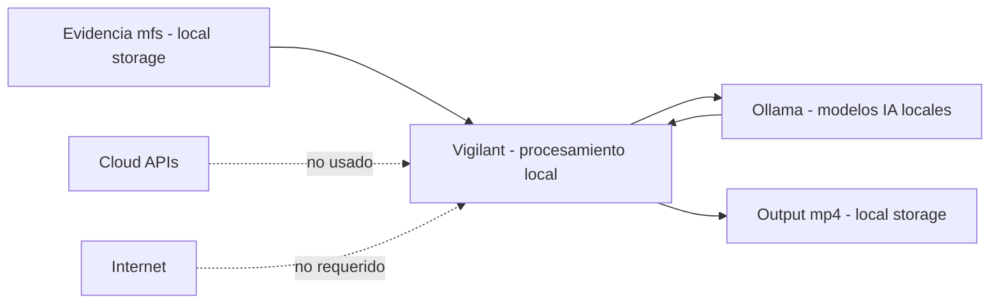

# Consideraciones Legales y Limitaciones

Este documento define la postura legal, restricciones de privacidad y limitaciones técnicas de Vigilant. Está dirigido a contextos forenses, judiciales y de cumplimiento donde la auditabilidad y cadena de custodia son críticas.

## 1. Disclaimer Legal

### Herramienta de Asistencia Investigativa

**Vigilant es una herramienta de ayuda investigativa, no un sistema de decisión automatizada.**

- **NO debe usarse** como única base para decisiones legales o disciplinarias
- **NO reemplaza** el juicio de investigadores calificados
- **NO proporciona** resultados determinísticos o infalibles
- **SÍ asiste** en revisión rápida de evidencia de video
- **SÍ mantiene** chain of custody de conversiones
- **SÍ permite** verificación independiente de integridad

### Naturaleza Probabilística de la IA

Los modelos de visión-lenguaje (LLaVA, Mistral) utilizados en el análisis:

- Generan resultados **probabilísticos**, no absolutos
- Pueden producir **falsos positivos** y **falsos negativos**
- Requieren **revisión humana obligatoria**
- No deben ser la **única evidencia** en un caso

**Flujo correcto:**

```
Video CCTV
    ↓
Conversión forense (alta confiabilidad)
    ↓
Análisis IA (asistencia para priorización)
    ↓
Revisión humana (OBLIGATORIA)
    ↓
Decisión informada
```

## 2. Cadena de Custodia y Diseño Local-First

### Principios de Diseño

Vigilant implementa un diseño **local-first** que protege la integridad de la evidencia:

**Características de seguridad:**

- **Sin cloud (por defecto):** No hay integración con APIs cloud; el análisis IA se envía a Ollama vía `VIGILANT_OLLAMA_URL`
- **Procesamiento local-first:** La IA se ejecuta en tu infraestructura (típicamente Ollama local)
- **Reproducible (conversión):** Registra comando/versión y normaliza metadata del contenedor para reducir variación entre ejecuciones
- **IA probabilística:** El análisis IA puede variar entre ejecuciones (no es determinístico)
- **Trazable:** Todos los hashes y metadata son verificables
- **Offline:** Funciona sin conexión a internet

> "Sin cloud" / "offline" asume que `VIGILANT_OLLAMA_URL` apunta a un servicio Ollama local (ej: `http://localhost:11434`)
> o a una red interna controlada. Si se configura a un host remoto, Vigilant enviará frames (imágenes) por HTTP a ese endpoint.
> Además, la descarga inicial de modelos (`ollama pull ...`) puede requerir internet.

**Beneficios forenses:**

- Reduce riesgo de exposición de evidencia sensible
- Puede ayudar a cumplir requisitos de privacidad (depende de procesos, controles y configuración)
- Permite deployment en entornos air-gapped
- Facilita auditorías de chain of custody

### Arquitectura Local



## 3. Privacidad y Protección de Datos

### Principios de Minimización

Vigilant sigue principios de **data minimization** y **privacy by design**:

1. **Exposición mínima:** Solo procesa archivos explícitamente especificados
2. **Almacenamiento local:** Todos los reportes e imágenes se guardan localmente
3. **Acceso controlado:** No hay transmisión a servicios cloud por defecto; si `VIGILANT_OLLAMA_URL` apunta a un host remoto, se enviarán frames por HTTP a ese endpoint
4. **Sin telemetría:** No se envían estadísticas de uso

### Compatibilidad con Frameworks Legales

| Framework | Cumplimiento | Notas |
|-----------|--------------|-------|
| **GDPR** (EU) | Depende del uso | Procesamiento local reduce exposición, pero requiere medidas organizacionales |
| **CCPA** (California) | Depende del uso | No hay telemetría/venta de datos por el software; evaluar operación completa |
| **HIPAA** (Healthcare) | Consult counsel | Verificar configuración de almacenamiento |
| **ISO 27001** | Depende del uso | Aporta controles técnicos, pero el cumplimiento es de la organización |

**Nota:** Vigilant proporciona herramientas técnicas. La responsabilidad legal del uso de evidencia recae en el operador y organización.

### Recomendaciones de Deployment

Para entornos con requisitos estrictos de privacidad:

```bash
# Deployment air-gapped (sin internet)
docker compose up -d

# Verificar que no hay conexiones externas
netstat -an | grep ESTABLISHED
# Solo debería mostrar: localhost:11434 (Ollama local)

# Logs en nivel INFO (sin análisis IA)
# Los logs INFO no incluyen texto de análisis IA, solo metadata de operación
# Para ver análisis completo usar: VIGILANT_LOG_LEVEL=DEBUG
tail -f logs/vigilant.log
```

## 4. Limitaciones Técnicas Conocidas

### 4.1 Falsos Positivos

**Problema:**
Los modelos de visión-lenguaje (VLM) pueden "alucinar" detalles que no existen en el frame.

**Causa:**
- Modelos preentrenados tienen sesgos
- Prompts dirigidos pueden inducir confirmación
- Baja resolución de frames puede generar ambigüedad

**Mitigación actual:**
- Prefiltro con YOLO reduce ruido
- Threshold de embeddings descarta matches débiles
- Análisis de múltiples frames para confirmación

**Práctica recomendada:**
```bash
# Analizar con múltiples criterios
vigilant analyze --prompt "person with red jacket"
vigilant analyze --prompt "pedestrian red clothing"

# Comparar resultados y revisar intersección
```

### 4.2 Pérdida de Recall en Eventos Rápidos

**Problema:**
El sampling de frames puede perder eventos muy breves.

**Causa:**
- Intervalo de extracción (default: 10 segundos)
- Eventos que duran < intervalo pueden no ser capturados

**Mitigación:**
```yaml
# config/local.yaml
ai:
  sample_interval: 1  # Más granular, más frames
frames:
  mode: "interval+scene"   # Detectar cambios de escena
```

**Trade-off:**
- Menor intervalo = Mayor recall + Más tiempo de procesamiento
- Interval 1s: ~10x más frames que interval 10s

**Recomendación:**
Ajustar según tipo de escenario:

| Escenario | Intervalo Sugerido |
|-----------|-------------------|
| Tráfico vehicular rápido | 1-2 segundos |
| Peatones en plaza | 3-5 segundos |
| Entrada fija (puerta) | 5-10 segundos |

### 4.3 Restricciones de Resolución

**Problema:**
El redimensionamiento de frames (default: `scale=480`, ancho) puede ocultar objetos pequeños o distantes.

**Causa:**
- Balance entre velocidad y detalle
- Modelos VLM tienen límite de input size

**Configuración:**
```yaml
frames:
  scale: 1920  # Ancho de salida (más detalles, más lento)
```

**Impacto (referencial):**
- `scale=480`: ~0.5s por frame con LLaVA
- `scale=1920`: ~1.5s por frame con LLaVA

### 4.4 Limitaciones de Detección de Movimiento

**Problema:**
El filtro de movimiento basado en bounding boxes puede fallar en ciertos casos.

**Casos problemáticos:**
- **Oclusión:** Objeto desaparece detrás de otro
- **Bajo contraste:** Objeto similar al fondo
- **Objetos pequeños:** Menor a 50x50 píxeles
- **Vibración de cámara:** Genera falsos movimientos

**Logs de ejemplo:**
```
[DEBUG] Frame 0045: motion_detected=False (bbox_displacement=2px < threshold=10px)
[DEBUG] Frame 0046: motion_detected=True (bbox_displacement=45px)
```

**Workaround:**
Reducir threshold de movimiento:

```yaml
motion:
  enable: true
  min_displacement_px: 5  # Default: 12
  min_frames: 2
```

### 4.5 Timestamps Aproximados en Reportes

**Problema:**
Los timestamps en los reportes se calculan a partir del índice de frame y el intervalo de muestreo,
por lo que son **aproximados** (especialmente en modo `scene` o `interval+scene`).

**Recomendación:**
Verificar timestamps críticos en un reproductor de video o usar modo `interval` para estimaciones más estables.

## 5. Sesgo de Modelo y Domain Shift

### Rendimiento Variable por Escenario

Los modelos VLM preentrenados pueden tener **bajo rendimiento** en:

- **Escenas con poca luz:** Cámaras nocturnas, infrarrojo
- **Ángulos inusuales:** Cenital, contrapicado extremo
- **Motion blur:** Objetos muy rápidos, cámara en movimiento
- **Objetos no estándar:** Equipamiento industrial, vehículos especializados

**Recomendación:**

```bash
# Validar en muestra representativa ANTES de procesamiento masivo
vigilant analyze --video /ruta/al/video_noche.mp4 --prompt "vehicle"
vigilant analyze --video /ruta/al/video_dia.mp4 --prompt "vehicle"

# Comparar resultados y ajustar configuración
```

### Fine-tuning No Soportado

Vigilant **no incluye** capacidad de fine-tuning de modelos. Se usan modelos preentrenados estándar de Ollama.

**Alternativa:**
- Ajustar prompts para mejor matching
- Usar YOLO custom entrenado (si aplica)
- Configurar thresholds de confianza

## 6. Advertencias sobre Reportes

### Calidad del Reporte = Calidad de Detecciones

Los reportes generados por Mistral son **tan buenos como las detecciones upstream**:

```
Detecciones LLaVA (incorrectas)
    ↓
Reporte Mistral (incorrectas también)
```

**Por lo tanto:**

1. **Revisar screenshots:** Validar visualmente cada frame identificado
2. **Verificar timestamps:** Correlacionar con metadata de video
3. **Contrastar con video original:** Reproducir secciones identificadas

### Sanitización del Informe Jurídico (IA)

El texto del "Informe juridico (IA)" puede ser **sanitizado** y, en algunos casos, descartado si:
- No respeta el formato esperado (secciones + bullets).
- Incluye afirmaciones no verificables o patrones filtrados.

En ese caso el reporte puede mostrar una leyenda indicando que el contenido fue descartado por sanitización.

**Ejemplo de revisión:**

```markdown
## Frame #0087 (00:01:27)
LLaVA: "Person in red jacket walking"

Reviewer notes:
- ✅ Person confirmed
- ❌ Jacket is ORANGE, not red (lighting issue)
- ✅ Walking confirmed
```

## 7. Prácticas Operativas Recomendadas

### 7.1 Preservar Evidencia Raw

**Correcto:**
```bash
# Input y output en directorios separados
vigilant convert --input-dir /evidence/raw --output-dir /evidence/processed

# Raw se mantiene intacto
ls /evidence/raw/  # Archivos originales
ls /evidence/processed/  # Archivos convertidos
```

**Incorrecto:**
```bash
# Sobrescribir originals
vigilant convert && rm -rf /evidence/raw
```

### 7.2 Registrar Todas las Ejecuciones

**Log de operaciones:**

```bash
# Redirigir logs a archivo
vigilant convert 2>&1 | tee logs/conversion_$(date +%Y%m%d_%H%M%S).log

# O usar level DEBUG para más detalles
VIGILANT_LOG_LEVEL=DEBUG vigilant analyze --prompt "test" 2>&1 | tee logs/analysis.log
```

### 7.3 Snapshot de Configuración

```bash
# Antes de procesamiento importante
cp config/local.yaml evidence/case_123_config_snapshot_$(date +%Y%m%d).yaml

# Incluir en documentación de caso
```

### 7.4 Retener Inputs y Outputs

**Estructura de archivado:**

```
case_INV_2026_0131/
├── raw/
│   └── original_footage.mfs          # Input original
├── processed/
│   ├── original_footage.mp4          # Output convertido
│   ├── original_footage.mp4.sha256
│   └── original_footage.mp4.integrity.json
├── analysis/
│   ├── report_person_search.md       # Reporte IA
│   └── imgs/
│       ├── frame_0045.jpg
│       └── frame_0087.jpg
├── config/
│   └── config_snapshot_20260131.yaml
└── logs/
    ├── conversion.log
    └── analysis.log
```

## 8. Responsabilidad del Usuario

### Uso Correcto

El operador de Vigilant es responsable de:

- Validar resultados de IA antes de actuar
- Mantener chain of custody apropiada
- Cumplir con leyes locales de privacidad
- Documentar limitaciones en reportes legales
- No depender exclusivamente de detecciones automáticas

### Uso Incorrecto

**Prohibido:**

- Usar detecciones IA como evidencia única
- Procesar datos sin autorización legal
- Compartir evidencia sensible sin protección
- Deployment en producción sin validación
- Decisiones automatizadas sin revisión humana

## 9. Contacto y Reporte de Problemas

### Reporte de Bugs

```bash
# Generar reporte de diagnóstico
vigilant --version
ollama --version
python --version

# Incluir logs relevantes (REDACTAR información sensible)
```

GitHub Issues: https://github.com/matzalazar/vigilant/issues

### Disclosure de Vulnerabilidades

Para reportes de seguridad sensibles, contactar directamente al mantenedor:

**Email:** matias.zalazar@icloud.com

No publicar vulnerabilidades de seguridad en issues públicos.

## 10. Actualizaciones y Cambios

Este documento puede actualizarse para reflejar:

- Nuevas limitaciones descubiertas
- Cambios en regulaciones legales
- Mejoras en capacidades técnicas

**Versión:** 1.0  
**Última actualización:** 2026-01-31

## Resumen Ejecutivo

| Aspecto | Status | Notas |
|---------|---------|-------|
| **Chain of Custody** | Robusta | SHA-256, metadata completa |
| **Privacidad** | Local-first | Sin transferencia de datos |
| **IA como Evidencia Única** | NO | Requiere revisión humana |
| **Falsos Positivos** | Posibles | Validación obligatoria |
| **Reproducibilidad** | Alta | Configuración + hashes |
| **Cumplimiento Legal** | Depende | Consultar con counsel legal |

---

**Conclusión:** Vigilant es una herramienta de asistencia técnica forense con capacidades sólidas de chain of custody. Las salidas de IA requieren obligatoriamente revisión humana calificada antes de uso en contextos legales. El diseño local-first protege la privacidad de evidencia sensible.
