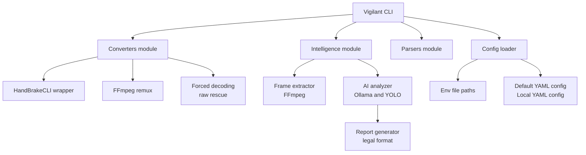

# Technical Architecture

This document describes the runtime architecture, module boundaries, and data flow through the Vigilant pipeline.

## 1. High-Level Data Flow

## 2. Module Boundaries

### 2.1 Core
`vigilant/core`

- `config.py`: YAML + env loader, scenario profiles, defaults
- `logger.py`: Console + file logging, level control

### 2.2 Converters
`vigilant/converters`

- `handbrake.py`: Primary transcode to MP4
- `ffmpeg.py`: Remux fallback (copy)
- `rescue.py`: Codec hints, offset scanning, forced decoding, rawvideo fallback

### 2.3 Parsers
`vigilant/parsers`

- `pdf_parser.py`: Extracts metadata to JSON

### 2.4 Intelligence
`vigilant/intelligence`

- `frame_extractor.py`: Sample/scene-based frame generation (FFmpeg)
- `analyzer.py`: LLaVA pre-filter + deep analysis + report generation
- YOLO pre-filter and motion logic integrated at CLI level

## 3. CLI Entry Points

`vigilant/cli.py` exposes:

- `convert`: Batch MFS to MP4 with rescue
- `parse`: PDF metadata extraction
- `analyze`: Multi-stage AI analysis

These commands are intentionally orthogonal and can be composed into external automation pipelines.

## 4. Config and Profiles Resolution

The configuration is loaded from:

1) `config/default.yaml`
2) `config/local.yaml`
3) Environment variables

After merging YAML files, scenario profiles can apply overrides based on `scenario` fields (camera, lighting, motion). Environment variables always win.

## 5. Output Artifacts

The pipeline emits reproducible artifacts:

- MP4 output mirroring the input directory structure
- JSON metadata from PDF parsing
- Analysis reports in `data/reports/md/`
- Hit screenshots in `data/reports/imgs/`

Temporary work data:
- `data/tmp/<video>/` for frame extraction

## 6. Observability

Logging is structured:

- Console: concise, human-readable
- File: verbose for post-mortem inspection

This enables forensic traceability for:
- conversions
- rescue attempts
- analysis prompts
- match counts and timings
