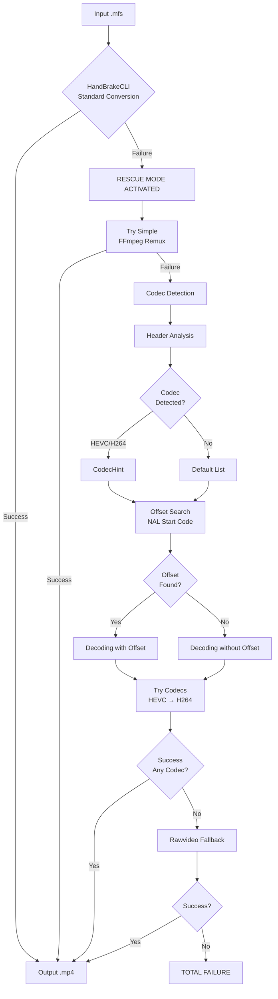

# Rescue Mode Pipeline - Technical Documentation

This document describes the internal functioning of Vigilant's rescue mode pipeline for recovering corrupt or non-standard video files.

> [!IMPORTANT]
> Vigilant **is only executed via CLI**. This document shows the internal implementation for technical reference.

## Context

Proprietary CCTV files (currently `.mfs`) frequently present issues:

- **Non-Standard Codec:** Use of proprietary codecs or modifications to standard codecs
- **Partial Corruption:** Recordings interrupted by power failure or system crashes
- **Invalid Headers:** Corrupt metadata that prevents decoding with standard tools
- **Incomplete Streams:** Lack of index information or fragmentation
- **Non-Standard Multiplexing:** Containers that do not follow full specifications

**HandBrakeCLI** is the primary tool for conversion, but it fails in the face of these problems. The **rescue mode pipeline** implements progressive recovery strategies.

## Pipeline Architecture



## Rescue Mode Phases

The rescue mode pipeline implements the following strategies in order:

### 1. Simple Remux (Prior Phase)

**Objective:** Attempt a simple conversion preserving the original structure.

Before activating full rescue mode, a basic remux is attempted:

```python
def fallback_conversion_ffmpeg(input_path: Path, output_path: Path) -> bool:
    """Attempts simple conversion with FFmpeg."""
    cmd = [
        "ffmpeg", "-y", "-i", str(input_path),
        "-map_metadata", "-1",
        "-map_chapters", "-1",
        "-fflags", "+bitexact",
        "-flags:v", "+bitexact",
        "-flags:a", "+bitexact",
        "-c", "copy", str(output_path),
    ]
    # ...
```

Results vary depending on the origin and condition of the file.

---

### 2. Codec Detection by Header

**Objective:** Analyze the file header to identify the codec.

```python
def detect_codec_hint(path: Path) -> Optional[str]:
    """
    Detects the video codec by analyzing the file header.
    
    Returns:
        str | None: 'hevc', 'h264', or None if not detected
    """
    header = _read_header(path, size=512)
    header_lower = header.lower()
    
    if b"hevc" in header_lower or b"hvc1" in header_lower or b"hev1" in header_lower:
        return "hevc"
    if b"h264" in header_lower or b"avc1" in header_lower:
        return "h264"
    
    return None
```

**Sought patterns:**
- HEVC: `hevc`, `hvc1`, `hev1`
- H.264: `h264`, `avc1`

---

### 3. Offset Search (NAL Start Code)

**Objective:** Find the start of the video stream when the container is corrupt.

```python
def find_start_code_offset(path: Path) -> Optional[int]:
    """
    Searches for the offset of the first start code (NAL unit).
    Patterns: 0x00000001 or 0x000001
    """
    patterns = (b"\x00\x00\x00\x01", b"\x00\x00\x01")
    # Reads in chunks and returns the offset if found
```

---

### 4. Forced Decoding (HEVC/H264)

**Objective:** Force decoding when HandBrake and remux fail.

Example command (bitexact):

```bash
ffmpeg -y -f hevc -i <source> -map_metadata -1 -map_chapters -1 -fflags +bitexact -flags:v +bitexact -flags:a +bitexact <output>.mp4
```

If an offset is detected, Vigilant first extracts a temporary file to `data/tmp/` and then decodes from that file. The command recorded in metadata reflects the temporary file used.

---

### 5. Rawvideo Fallback

**Objective:** Last resort when no detectable codec is found.

```bash
ffmpeg -y -f rawvideo -pix_fmt <pix_fmt> -s:v <resolution> -r <fps> -i <input> -map_metadata -1 -map_chapters -1 -fflags +bitexact -flags:v +bitexact -flags:a +bitexact <output>.mp4
```

The `pix_fmt`, `resolution`, and `fps` parameters are configured in `config/*.yaml` under the `raw` section.

---

## Recommended Validation (Manual)

Rescue mode **does not automatically validate** the output quality. For manual verification:

```bash
# Verify that the file is playable and has valid streams
ffprobe recovered.mp4

# Verify hash if .sha256 exists
sha256sum -c recovered.mp4.sha256
```

---

## Rescue Metadata

Rescued files generate special metadata:

```json
{
  "integrity_version": "1.0",
  "timestamp": "2026-02-06T11:33:08.314647+00:00",
  "source": {
    "path": "/input/corrupted_footage.mfs",
    "filename": "corrupted_footage.mfs",
    "sha256": "47432a84955d59956e3ee4cc945bba5d...",
    "size_bytes": 12499529
  },
  "converted": {
    "path": "/output/corrupted_footage_forced.mp4",
    "filename": "corrupted_footage_forced.mp4",
    "sha256": "169b6661d05992cab6c697f933cf522c...",
    "size_bytes": 29298412
  },
  "conversion": {
    "tool": "ffmpeg rescue",
    "preset": null,
    "command": "ffmpeg -y -f hevc -i /app/data/tmp/corrupted_footage_abc123.bin -map_metadata -1 -map_chapters -1 -fflags +bitexact -flags:v +bitexact -flags:a +bitexact /output/corrupted_footage_forced.mp4",
    "tool_version": "ffmpeg version n8.0.1 Copyright (c) 2000-2025 the FFmpeg developers",
    "rescue_mode": true,
    "rescue_details": {
      "technique": "force_decode_hevc",
      "codec_hint": "hevc",
      "offset_found": true,
      "offset_bytes": 91,
      "extraction_method": "offset_copy",
      "extracted_path": "/app/data/tmp/corrupted_footage_abc123.bin",
      "bitexact_flags": true
    }
  }
}
```

**`rescue_details` fields:**
- `technique`: Successful technique (`force_decode_hevc`, `force_decode_h264`, `rawvideo`)
- `codec_hint`: Codec detected by header analysis (`hevc`, `h264`, `null`)  
- `offset_found`: Whether a NAL start code was found (`true`/`false`)
- `offset_bytes`: Offset in bytes if found (optional)
- `extraction_method`: Extraction method (e.g., `offset_copy`) if applicable
- `extracted_path`: Temporary file used during rescue (optional; may not exist after completion)
- `bitexact_flags`: Whether reproducibility flags were applied in FFmpeg

---

## Rescue Mode Logs

Rescue mode generates detailed logs:

```
2026-01-31 14:45:10 INFO - converting path=/corrupted_footage.mfs
2026-01-31 14:45:15 ERROR - failure path=/corrupted_footage.mfs err=codec not supported
2026-01-31 14:45:15 INFO - failure path=/corrupted_footage.mfs rescue=yes
2026-01-31 14:45:16 INFO - remux path=/corrupted_footage.mfs
2026-01-31 14:45:17 ERROR - remux failed path=/corrupted_footage.mfs
2026-01-31 14:45:18 INFO - rescue path=/corrupted_footage.mfs
2026-01-31 14:45:43 INFO - rescue ok path=/corrupted_footage.mfs
2026-01-31 14:45:45 INFO - original hash=a3f5e9c2... file=/corrupted_footage.mfs
2026-01-31 14:45:45 INFO - converted hash=d9e3f6a0b5c8d2e7... file=/corrupted_footage_forced.mp4
2026-01-31 14:45:45 INFO - integrity saved path=/corrupted_footage_forced.mp4.integrity.json
```

---

## Known Limitations

1. **Audio may be lost:** Rescue mode prioritizes video. Audio may not synchronize or may be lost.
2. **Variable quality:** Rescued videos may have visual artifacts.
3. **Imprecise timestamps:** Forced decoding can produce inaccurate timestamps.
4. **Does not work with encryption:** Encrypted files are not recoverable.
5. **Performance:** Rescue mode is slower than standard conversion.

---

## Activation (CLI)

Rescue mode is automatically activated from the CLI when HandBrake fails (by default).

```bash
vigilant convert

# (Optional) Disable rescue mode
vigilant convert --no-rescue
```

---

## Technical References

- **FFmpeg Error Detection:** https://ffmpeg.org/ffmpeg-formats.html#Format-Options
- **H.264 NAL Units:** ITU-T H.264 Specification
- **MP4 Container:** ISO/IEC 14496-14
- **Forensic Video Recovery:** NIST Guidelines for Digital Forensics

---

## Conclusion

Vigilant's rescue mode pipeline implements progressive recovery techniques that allow for the conversion of CCTV files that standard tools cannot process:

1. **Simple Remux**: Direct conversion preserving structure
2. **Codec Detection**: Header analysis to identify format
3. **Offset Search**: Localization of NAL start codes
4. **Forced Decoding**: Systematic testing with HEVC/H264
5. **Rawvideo Fallback**: Last resort for extreme cases

While it does not guarantee success in all cases, it offers a recovery with full forensic metadata that includes:
- Exact command executed
- Rescue technique used
- Codec detected
- Offset information where applicable

The generated metadata allows for complete traceability of the rescue process for forensic audits.
