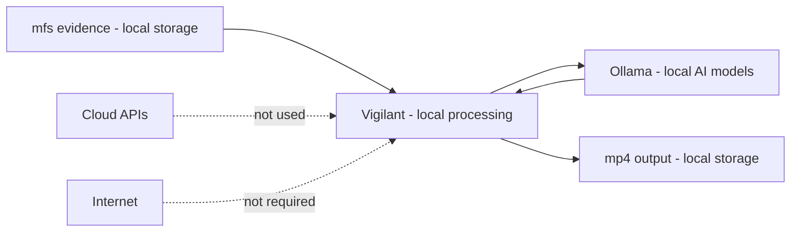

# Legal Considerations and Limitations

This document defines the legal posture, privacy restrictions, and technical limitations of Vigilant. It is aimed at forensic, judicial, and compliance contexts where auditability and chain of custody are critical.

## 1. Legal Disclaimer

### Investigative Assistance Tool

**Vigilant is an investigative aid tool, not an automated decision system.**

- **Should NOT be used** as the sole basis for legal or disciplinary decisions
- **Does NOT replace** the judgment of qualified investigators
- **Does NOT provide** deterministic or infallible results
- **DOES assist** in rapid review of video evidence
- **DOES maintain** chain of custody of conversions
- **DOES allow** independent verification of integrity

### Probabilistic Nature of AI

The vision-language models (LLaVA, Mistral) used in the analysis:

- Generate **probabilistic** results, not absolute ones
- Can produce **false positives** and **false negatives**
- Require **mandatory human review**
- Should not be the **only evidence** in a case

**Correct workflow:**

```
CCTV Video
    ↓
Forensic conversion (high reliability)
    ↓
AI analysis (assistance for prioritization)
    ↓
Human review (MANDATORY)
    ↓
Informed decision
```

## 2. Chain of Custody and Local-First Design

### Design Principles

Vigilant implements a **local-first** design that protects the integrity of the evidence:

**Security features:**

- **No cloud (by default):** There is no integration with cloud APIs; AI analysis is sent to Ollama via `VIGILANT_OLLAMA_URL`
- **Local-first processing:** AI runs on your infrastructure (typically local Ollama)
- **Reproducible (conversion):** Records command/version and normalizes container metadata to reduce variation between executions
- **Probabilistic AI:** AI analysis may vary between executions (it is not deterministic)
- **Traceable:** All hashes and metadata are verifiable
- **Offline:** Works without an internet connection

> "No cloud" / "offline" assumes that `VIGILANT_OLLAMA_URL` points to a local Ollama service (e.g., `http://localhost:11434`)
> or a controlled internal network. If configured to a remote host, Vigilant will send frames (images) via HTTP to that endpoint.
> Furthermore, the initial download of models (`ollama pull ...`) may require internet.

**Forensic benefits:**

- Reduces risk of exposing sensitive evidence
- Can help meet privacy requirements (depends on processes, controls, and configuration)
- Allows deployment in air-gapped environments
- Facilitates chain of custody audits

### Local Architecture



## 3. Privacy and Data Protection

### Minimization Principles

Vigilant follows **data minimization** and **privacy by design** principles:

1. **Minimum exposure:** Only processes explicitly specified files
2. **Local storage:** All reports and images are saved locally
3. **Controlled access:** No transmission to cloud services by default; if `VIGILANT_OLLAMA_URL` points to a remote host, frames will be sent via HTTP to that endpoint
4. **No telemetry:** No usage statistics are sent

### Compatibility with Legal Frameworks

| Framework | Compliance | Notes |
|-----------|--------------|-------|
| **GDPR** (EU) | Depends on use | Local processing reduces exposure, but requires organizational measures |
| **CCPA** (California) | Depends on use | No telemetry/data selling by the software; evaluate complete operation |
| **HIPAA** (Healthcare) | Consult counsel | Verify storage configuration |
| **ISO 27001** | Depends on use | Provides technical controls, but compliance is the organization's responsibility |

**Note:** Vigilant provides technical tools. Legal responsibility for the use of evidence rests with the operator and organization.

### Deployment Recommendations

For environments with strict privacy requirements:

```bash
# Air-gapped deployment (no internet)
docker compose up -d

# Verify no external connections
netstat -an | grep ESTABLISHED
# Should only show: localhost:11434 (local Ollama)

# Logs at INFO level (no AI analysis)
# INFO logs do not include AI analysis text, only operation metadata
# To see full analysis use: VIGILANT_LOG_LEVEL=DEBUG
tail -f logs/vigilant.log
```

## 4. Known Technical Limitations

### 4.1 False Positives

**Problem:**
Vision-language models (VLM) can "hallucinate" details that do not exist in the frame.

**Cause:**
- Pre-trained models have biases
- Leading prompts can induce confirmation
- Low frame resolution can generate ambiguity

**Current mitigation:**
- YOLO pre-filter reduces noise
- Embedding threshold discards weak matches
- Multi-frame analysis for confirmation

**Recommended practice:**
```bash
# Analyze with multiple criteria
vigilant analyze --prompt "person with red jacket"
vigilant analyze --prompt "pedestrian red clothing"

# Compare results and check intersection
```

### 4.2 Recall Loss in Fast Events

**Problem:**
Frame sampling can miss very brief events.

**Cause:**
- Extraction interval (default: 10 seconds)
- Events lasting < interval may not be captured

**Mitigation:**
```yaml
# config/local.yaml
ai:
  sample_interval: 1  # More granular, more frames
frames:
  mode: "interval+scene"   # Detect scene changes
```

**Trade-off:**
- Smaller interval = Higher recall + More processing time
- Interval 1s: ~10x more frames than interval 10s

**Recommendation:**
Adjust according to scenario type:

| Scenario | Suggested Interval |
|-----------|-------------------|
| Fast vehicle traffic | 1-2 seconds |
| Pedestrians in plaza | 3-5 seconds |
| Fixed entry (door) | 5-10 seconds |

### 4.3 Resolution Restrictions

**Problem:**
Frame resizing (default: `scale=480`, width) can hide small or distant objects.

**Cause:**
- Balance between speed and detail
- VLM models have an input size limit

**Configuration:**
```yaml
frames:
  scale: 1920  # Output width (more details, slower)
```

**Impact (referential):**
- `scale=480`: ~0.5s per frame with LLaVA
- `scale=1920`: ~1.5s per frame with LLaVA

### 4.4 Motion Detection Limitations

**Problem:**
The motion filter based on bounding boxes can fail in certain cases.

**Problematic cases:**
- **Occlusion:** Object disappears behind another
- **Low contrast:** Object similar to background
- **Small objects:** Smaller than 50x50 pixels
- **Camera vibration:** Generates false movements

**Example logs:**
```
[DEBUG] Frame 0045: motion_detected=False (bbox_displacement=2px < threshold=10px)
[DEBUG] Frame 0046: motion_detected=True (bbox_displacement=45px)
```

**Workaround:**
Reduce motion threshold:

```yaml
motion:
  enable: true
  min_displacement_px: 5  # Default: 12
  min_frames: 2
```

### 4.5 Approximate Timestamps in Reports

**Problem:**
Timestamps in reports are calculated from frame index and sampling interval,
so they are **approximate** (especially in `scene` or `interval+scene` mode).

**Recommendation:**
Verify critical timestamps in a video player or use `interval` mode for more stable estimates.

## 5. Model Bias and Domain Shift

### Variable Performance by Scenario

Pre-trained VLM models may have **poor performance** in:

- **Low-light scenes:** Night cameras, infrared
- **Unusual angles:** Overhead, extreme low-angle
- **Motion blur:** Very fast objects, moving camera
- **Non-standard objects:** Industrial equipment, specialized vehicles

**Recommendation:**

```bash
# Validate on representative sample BEFORE mass processing
vigilant analyze --video /path/to/night_video.mp4 --prompt "vehicle"
vigilant analyze --video /path/to/day_video.mp4 --prompt "vehicle"

# Compare results and adjust configuration
```

### Fine-tuning Not Supported

Vigilant **does not include** model fine-tuning capability. Standard pre-trained models from Ollama are used.

**Alternative:**
- Adjust prompts for better matching
- Use custom trained YOLO (if applicable)
- Configure confidence thresholds

## 6. Warnings about Reports

### Report Quality = Detection Quality

Reports generated by Mistral are **as good as the upstream detections**:

```
LLaVA detections (incorrect)
    ↓
Mistral report (incorrect too)
```

**Therefore:**

1. **Review screenshots:** Visually validate each identified frame
2. **Verify timestamps:** Correlate with video metadata
3. **Contrast with original video:** Playback identified sections

### Legal Report (AI) Sanitization

The text of the "legal report (AI)" may be **sanitized** and, in some cases, discarded if:
- It does not follow the expected format (sections + bullets).
- It includes unverifiable claims or filtered patterns.

In that case, the report may show a legend indicating that the content was discarded due to sanitization.

**Review example:**

```markdown
## Frame #0087 (00:01:27)
LLaVA: "Person in red jacket walking"

Reviewer notes:
- ✅ Person confirmed
- ❌ Jacket is ORANGE, not red (lighting issue)
- ✅ Walking confirmed
```

## 7. Recommended Operational Practices

### 7.1 Preserve Raw Evidence

**Correct:**
```bash
# Input and output in separate directories
vigilant convert --input-dir /evidence/raw --output-dir /evidence/processed

# Raw remains intact
ls /evidence/raw/  # Original files
ls /evidence/processed/  # Converted files
```

**Incorrect:**
```bash
# Overwrite originals
vigilant convert && rm -rf /evidence/raw
```

### 7.2 Record All Executions

**Operations log:**

```bash
# Redirect logs to file
vigilant convert 2>&1 | tee logs/conversion_$(date +%Y%m%d_%H%M%S).log

# Or use DEBUG level for more details
VIGILANT_LOG_LEVEL=DEBUG vigilant analyze --prompt "test" 2>&1 | tee logs/analysis.log
```

### 7.3 Configuration Snapshot

```bash
# Before important processing
cp config/local.yaml evidence/case_123_config_snapshot_$(date +%Y%m%d).yaml

# Include in case documentation
```

### 7.4 Retain Inputs and Outputs

**Archiving structure:**

```
case_INV_2026_0131/
├── raw/
│   └── original_footage.mfs          # Original input
├── processed/
│   ├── original_footage.mp4          # Converted output
│   ├── original_footage.mp4.sha256
│   └── original_footage.mp4.integrity.json
├── analysis/
│   ├── report_person_search.md       # AI report
│   └── imgs/
│       ├── frame_0045.jpg
│       └── frame_0087.jpg
├── config/
│   └── config_snapshot_20260131.yaml
└── logs/
    ├── conversion.log
    └── analysis.log
```

## 8. User Responsibility

### Correct Use

The Vigilant operator is responsible for:

- Validating AI results before acting
- Maintaining appropriate chain of custody
- Complying with local privacy laws
- Documenting limitations in legal reports
- Not relying exclusively on automatic detections

### Incorrect Use

**Prohibited:**

- Using AI detections as sole evidence
- Processing data without legal authorization
- Sharing sensitive evidence without protection
- Production deployment without validation
- Automated decisions without human review

## 9. Contact and Problem Reporting

### Bug Reporting

```bash
# Generate diagnostic report
vigilant --version
ollama --version
python --version

# Include relevant logs (REDACT sensitive information)
```

GitHub Issues: https://github.com/matzalazar/vigilant/issues

### Vulnerability Disclosure

For sensitive security reports, contact the maintainer directly:

**Email:** matias.zalazar@icloud.com

Do not publish security vulnerabilities in public issues.

## 10. Updates and Changes

This document may be updated to reflect:

- New limitations discovered
- Changes in legal regulations
- Improvements in technical capabilities

**Version:** 1.0  
**Last updated:** 2026-01-31

## Executive Summary

| Aspect | Status | Notes |
|---------|---------|-------|
| **Chain of Custody** | Robust | SHA-256, complete metadata |
| **Privacy** | Local-first | No data transfer |
| **AI as Sole Evidence** | NO | Requires human review |
| **False Positives** | Possible | Mandatory validation |
| **Reproducibility** | High | Configuration + hashes |
| **Legal Compliance** | Depends | Consult with legal counsel |

---

**Conclusion:** Vigilant is a forensic technical assistance tool with solid chain of custody capabilities. AI outputs mandatory qualified human review before use in legal contexts. The local-first design protects the privacy of sensitive evidence.
