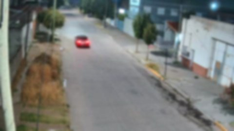
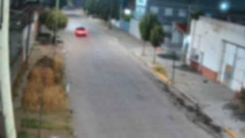
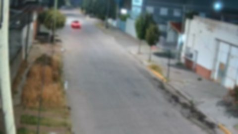

# Vigilant Analysis Report
**Prompt:** a black car moving

> [!WARNING]
> **Timestamps Aproximados**: Los timestamps mostrados son estimaciones basadas en índice de frame × intervalo de extracción.
> En modo `scene` o `interval+scene`, pueden tener margen de error de varios segundos respecto al tiempo real del video.
> Para timestamps precisos al segundo, verificar con reproductor de video o usar solo modo `interval`.

## Informe juridico (IA)
Hechos Observables:
- Video: 1234-Calle A 1300 y Calle B 500_2026-05-23T02_29_00_0_6_0_0_forced.mp4

Observaciones:
- Las imágenes del video muestran una calle vacía durante la noche, con edificios a ambos lados y árboles dispersos.

Limitaciones:
- No se proporciona información sobre la velocidad del vehículo negro, su destino o su identificación específica.
- La calidad de las imágenes puede afectar la precisión de la detección y el análisis del vehículo en movimiento.

## Video: `1234-Calle A 1300 y Calle B 500_2026-05-23T02_29_00_0_6_0_0_forced.mp4`
**SHA-256**: `169b6661d05992cab6c697f933cf522cea85556c6e6fe89287e952491b4be5ef`
**Duración:** 00:06:00
**Frames analizados:** 399

- **Hit**: La imagen muestra una calle vacía con edificios de dos pisos a cada lado. En el centro, un carro negro está en movimiento activo, detectado por dos frames consecutivos. Esto sugiere que el carro ha sido capturado en dos momentos diferentes, lo que indica que está en transporte activo durante la noche. La ausencia de otros vehículos o personas en la calle y la iluminación artificial de las casas y edificios también apoyan la idea de que el carro es el único objeto en movimiento en ese momento.
  - Frame: 170/399
  - Timestamp: 00:02:49
  - Prefiltro: car(1) (conf 84%)
  - Movimiento: confirmado
  - Image: `../imgs/1234-Calle A 1300 y Calle B 500_2026-05-23T02_29_00_0_6_0_0_forced_i_169.jpg`
  
- **Hit**: La imagen muestra una calle vacía con edificios a ambos lados y árboles dispersos. En el centro de la imagen, un carro negro se mueve hacia la derecha. Este movimiento es relevante porque coincide con el objetivo proporcionado, que es detectar un vehículo en movimiento activo. El carro negro se encuentra en tres frames consecutivos, lo que indica que está en movimiento y cumple con el criterio forense establecido para la detección de objetos en movimiento.
  - Frame: 171/399
  - Timestamp: 00:02:50
  - Prefiltro: car(1) (conf 88%)
  - Movimiento: confirmado
  - Image: `../imgs/1234-Calle A 1300 y Calle B 500_2026-05-23T02_29_00_0_6_0_0_forced_i_170.jpg`
  
- **Hit**: La imagen muestra una calle vacía durante la noche, con un cielo estrellado visible. En el centro de la imagen, se observa un vehículo que parece estar en movimiento activo, lo cual coincide con el objetivo proporcionado. El carro es un color oscuro y su posición cambia entre las cuatro imágenes consecutivas, indicando que está en movimiento. La ausencia de otros vehículos o personas en la calle sugiere que el vehículo es el único objeto en movimiento activo durante ese momento específico.
  - Frame: 172/399
  - Timestamp: 00:02:51
  - Prefiltro: car(1) (conf 77%)
  - Movimiento: confirmado
  - Image: `../imgs/1234-Calle A 1300 y Calle B 500_2026-05-23T02_29_00_0_6_0_0_forced_i_171.jpg`
  
